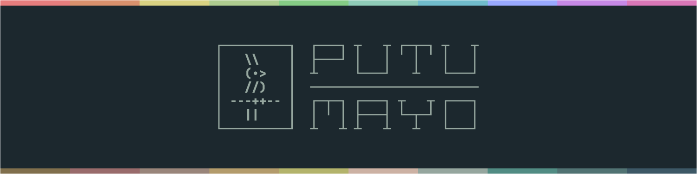

<h1>
<picture id="putumayo">
  <source media="(prefers-color-scheme: dark)" srcset="_assets/gh-header-midnight.svg">
  <source media="(prefers-color-scheme: light)" srcset="_assets/gh-header-midnight.svg">
  
</picture>
</h1>

Putumayo is a a rainforest-inspired color theme for CLI-oriented software developers.

## Features

- 🌓 Dark theme (light theme will be created in the future).
- 🎨 Meticulously crafted and balanced selection of colors.
- 📺 Focused on CLI products to give a pleasant experience for terminal users.
- 👥 AA accessibility in most cases.
- 🌳 Inspired by nature.

## Table of contents

  - [Features](#features)
  - [Table of Contents](#table-of-contents)
  - [Variants](#variants)
  - [Accessibility](#accessibility)
  - [Concept](#concept)
  - [Methodology](#color-scheme)
  - [Palette](#palette)

## Variants

Currently Putumayo has only a dark variant, but I'm expecting to develop a bright variant in the future.

The name of the dark variant is __Putumayo Midnight__, while the bright variant is referred to as __Putumayo Sunlight__.

## Accessibility 

Most of the foreground colors meet the WCAG 2.0 AA Conformance Level of color contrast when tested against the base background color bg10. The only ones that fail this criteria are _steel_ and _nightfog_ for the Putumayo Midnight variant, which are mostly recommended for low-contrast UI elements like disabled text, code comments, and line numbers.

## Concept

In the jungle you find yourself surrounded by millions of leaves displaying a multitude of green shades, from yellowish to bluish to brownish. The soil and the trunks exhibit an abundance of browns and greys. These colors give you a sense of serenity and recharge. But if you keep a watchful eye around, you'll start finding little treasures of color: a magnificent deep blue butterfly appears from nowhere; a little bright yellow frog stands still in a leave; a beautiful purple orchid hangs from a branch; a bunch of noisy red guacamayas fly from one tree to another.

That was the feeling I had when I visited the Putumayo rainforest in Colombia. Some weeks later, when I returned to work, I wondered if it was possible to somehow recall that sensation in my day to day use of the terminal. And that's how the Putumayo project was born. I decided to create a theme that balanced the muted main colors of the rainforest, with the vibrant ocasional colors of the exuberant little creatures that inhabit it.

In practice, this means that frequent/large elements in the UI or code should use various shades of green and brown —emulating the leaves, trunks, and soil—, while occasional/small elements should use shades of blue, magenta, red, orange, and yellow —emulating the flowers, butterflies, birds, and amphibians living inside—.

The result is a beautiful and pleasant color scheme that mixes both the calming tones and prismatic diversity of the rainforests of our planet.

## Methodology

The color palette was meticulously crafted to expose a balanced collection of swatches along with a simple but effective usage pattern for them. This configuration avoids visual fatigue during long coding sessions, while asisting focus.

This was achieved by observing the following principles:

- Background colors should admit a reasonable contrast between them and the main foreground color to ensure a clear readability while preventing long term visual exhaustion.

- Foreground colors should represent all main sections of the color wheel, with additional variations, to allow for an heterogeneous but cohesive arrangement.

- All colors in the palette should be defined using precise values of hue, saturation and lightness to obtain a harmonic set of easily distinguishable swatches.

- There should be a design guide to ensure that frequent/large elements are styled using calming/muted tones, while occasional/small elements are styled with distinctive/saturated ones, to aim for a unique balance between sobriety and enthusiasm.

## Palette

<table>
    <tr><th>Midnight</th><th>Sunlight</th></tr>
    <tr><td>
        
        <strong>Amethyst</strong> 
        <code>O/S</code> 
        <code>#C689E6</code> 
        <code>rgb(198,137,230)</code> 
        <code>hsl(279,65%,72%)</code> 
    </td><td>
        
        <strong>Unknown</strong> 
        <code>O/S</code> 
        <code>#888888</code> 
        <code>rgb(136,136,136)</code> 
        <code>hsl(0,0%,53%)</code> 
    </td></tr>
    <tr><td colspan="2">
        <ul>
            <li><strong>UI:</strong> Terminal magenta. Hint texts and markers.</li>
            <li><strong>Code:</strong> All keywords like <code>if</code>, <code>else</code>, <code>for</code>, <code>while</code>, <code>import</code>, <code>export</code>, <code>return</code>, <code>try</code>, <code>catch</code>, <code>or</code>, <code>and</code>, <code>in</code>, <code>of</code>, <code>from</code>, etc., except procedure-related and storage-related ones (see denim/unknown swatch).</li>
        </ul>
    </td></tr>
    <tr><td>
        
        <strong>Cherry</strong> 
        <code>O/S</code> 
        <code>#E67D7D</code> 
        <code>rgb(230,125,125)</code> 
        <code>hsl(0,68%,70%)</code> 
    </td><td>
        
        <strong>Unknown</strong> 
        <code>O/S</code> 
        <code>#888888</code> 
        <code>rgb(136,136,136)</code> 
        <code>hsl(0,0%,53%)</code> 
    </td></tr>
    <tr><td colspan="2">
        <ul>
            <li><strong>UI:</strong> Terminal red. Error texts and markers. Select/visual mode indicators in modal editors. Diff deletion indicators.</li>
            <li><strong>Code:</strong> Markdown bold texts.</li>
        </ul>
    </td></tr>
    <tr><td>
        
        <strong>Amber</strong> 
        <code>O/S</code> 
        <code>#D9D282</code> 
        <code>rgb(217,210,130)</code> 
        <code>hsl(55,53%,68%)</code> 
    </td><td>
        
        <strong>Unknown</strong> 
        <code>O/S</code> 
        <code>#888888</code> 
        <code>rgb(136,136,136)</code> 
        <code>hsl(0,0%,53%)</code> 
    </td></tr>
    <tr><td colspan="2">
        <ul>
            <li><strong>UI:</strong> Terminal yellow. Warning texts and markers. Diff modification indicators.</li>
            <li><strong>Code:</strong> Builtin varable and function identifiers. Markdown headings.</li>
        </ul>
    </td></tr>
    <tr><td>
        
        <strong>Paramo</strong> 
        <code>F/L</code> 
        <code>#AECC8F</code> 
        <code>rgb(174,204,143)</code> 
        <code>hsl(90,37%,68%)</code> 
    </td><td>
        
        <strong>Unknown</strong> 
        <code>F/L</code> 
        <code>#888888</code> 
        <code>rgb(136,136,136)</code> 
        <code>hsl(0,0%,53%)</code> 
    </td></tr>
    <tr><td colspan="2">
        <ul>
            <li><strong>UI:</strong> Terminal green.</li>
            <li><strong>Code:</strong> In general, used for precedure identifiers like function, method, constructor, and macro names, except builtin ones (see amber swatch).</li>
        </ul>
    </td></tr>
    <tr><td>
        
        <strong>Lichen</strong> 
        <code>F/L</code> 
        <code>#8FCCB8</code> 
        <code>rgb(143,204,184)</code> 
        <code>hsl(160,37%,68%)</code> 
    </td><td>
        
        <strong>Unknown</strong> 
        <code>F/L</code> 
        <code>#888888</code> 
        <code>rgb(136,136,136)</code> 
        <code>hsl(0,0%,53%)</code> 
    </td></tr>
    <tr><td colspan="2">
        <ul>
            <li><strong>UI:</strong> Terminal cyan.</li>
            <li><strong>Code:</strong> In general, used for variable identifiers like standard variable, function parameter, and user-defined constant names, except builtin ones (see amber swatch).</li>
        </ul>
    </td></tr>
    <tr><td>
        
        <strong>Denim</strong> 
        <code>O/S</code> 
        <code>#99A9FF</code> 
        <code>rgb(153,169,255)</code> 
        <code>hsl(231,100%,80%)</code> 
    </td><td>
        
        <strong>Unknown</strong> 
        <code>O/S</code> 
        <code>#888888</code> 
        <code>rgb(136,136,136)</code> 
        <code>hsl(0,0%,53%)</code> 
    </td></tr>
    <tr><td colspan="2">
        <ul>
            <li><strong>UI:</strong> Terminal blue. Info texts and markers. Info indicators. Diff moved indicators.</li>
            <li><strong>Code:</strong> All procedure-related and storage-related keywords like <code>var</code>, <code>let</code>, <code>const</code>, <code>mut</code>, <code>ref</code>, <code>def</code>, <code>class</code>, <code>function</code>, etc.</li>
        </ul>
    </td></tr>
    <tr><td>
        
        <strong>Nightfog</strong> 
        <code>O/S</code> 
        <code>#3D5866</code> 
        <code>rgb(61,88,102)</code> 
        <code>hsl(200,25%,32%)</code> 
    </td><td>
        
        <strong>Unknown</strong> 
        <code>O/S</code> 
        <code>#888888</code> 
        <code>rgb(136,136,136)</code> 
        <code>hsl(0,0%,53%)</code> 
    </td></tr>
    <tr><td colspan="2">
        <ul>
            <li><strong>UI:</strong> Terminal black. Line numbers. Inactive text. Window/panel separators. Prominent hidden text.</li>
            <li><strong>Code:</strong> No usage.</li>
        </ul>
    </td></tr>
    <tr><td>
        
        <strong>Beige</strong> 
        <code>O/S</code> 
        <code>#F2D2C2</code> 
        <code>rgb(242,210,194)</code> 
        <code>hsl(20,65%,85%)</code> 
    </td><td>
        
        <strong>Unknown</strong> 
        <code>O/S</code> 
        <code>#888888</code> 
        <code>rgb(136,136,136)</code> 
        <code>hsl(0,0%,53%)</code> 
    </td></tr>
    <tr><td colspan="2">
        <ul>
            <li><strong>UI:</strong> Terminal white.</li>
            <li><strong>Code:</strong> Highlights.</li>
        </ul>
    </td></tr>
    <tr><td>
        
        <strong>Fuchia</strong> 
        <code>O/S</code> 
        <code>#D977B7</code> 
        <code>rgb(217,119,183)</code> 
        <code>hsl(321,56%,66%)</code> 
    </td><td>
        
        <strong>Unknown</strong> 
        <code>O/S</code> 
        <code>#888888</code> 
        <code>rgb(136,136,136)</code> 
        <code>hsl(0,0%,53%)</code> 
    </td></tr>
    <tr><td colspan="2">
        <ul>
            <li><strong>UI:</strong> No usage.</li>
            <li><strong>Code:</strong> Logical, mathematical, and other operators. Special symbols like <code>?</code> in Rust, <code>...</code> in Hare. Markdown list dashes.</li>
        </ul>
    </td></tr>
    <tr><td>
        
        <strong>Orange</strong> 
        <code>O/S</code> 
        <code>#D9916D</code> 
        <code>rgb(217,145,109)</code> 
        <code>hsl(20,59%,64%)</code> 
    </td><td>
        
        <strong>Unknown</strong> 
        <code>O/S</code> 
        <code>#888888</code> 
        <code>rgb(136,136,136)</code> 
        <code>hsl(0,0%,53%)</code> 
    </td></tr>
    <tr><td colspan="2">
        <ul>
            <li><strong>UI:</strong> No usage.</li>
            <li><strong>Code:</strong> Character, numeric, and special constant literals like <code>true</code>, <code>false</code>, <code>none</code>, etc. Other special constants like escape codes. Markdown italic text.</li>
        </ul>
    </td></tr>
    <tr><td>
        
        <strong>Forest</strong> 
        <code>O/S</code> 
        <code>#85CC85</code> 
        <code>rgb(133,204,133)</code> 
        <code>hsl(120,41%,66%)</code> 
    </td><td>
        
        <strong>Unknown</strong> 
        <code>O/S</code> 
        <code>#888888</code> 
        <code>rgb(136,136,136)</code> 
        <code>hsl(0,0%,53%)</code> 
    </td></tr>
    <tr><td colspan="2">
        <ul>
            <li><strong>UI:</strong> Insert mode indicators in modal editors. Diff addition indicators.</li>
            <li><strong>Code:</strong> HTML/XML tag names (note that JSX tag names might be styled using constructor assigned swatches).</li>
        </ul>
    </td></tr>
    <tr><td>
        
        <strong>Teal</strong> 
        <code>O/S</code> 
        <code>#70BCCC</code> 
        <code>rgb(112,188,204)</code> 
        <code>hsl(190,47%,62%)</code> 
    </td><td>
        
        <strong>Unknown</strong> 
        <code>O/S</code> 
        <code>#888888</code> 
        <code>rgb(136,136,136)</code> 
        <code>hsl(0,0%,53%)</code> 
    </td></tr>
    <tr><td colspan="2">
        <ul>
            <li><strong>UI:</strong> No usage.</li>
            <li><strong>Code:</strong> Type identifiers including user-defined and builtin. Markdown quotes.</li>
        </ul>
    </td></tr>
    <tr><td>
        
        <strong>Khaki</strong> 
        <code>O/S</code> 
        <code>#CCB1A3</code> 
        <code>rgb(204,177,163)</code> 
        <code>hsl(20,29%,72%)</code> 
    </td><td>
        
        <strong>Unknown</strong> 
        <code>O/S</code> 
        <code>#888888</code> 
        <code>rgb(136,136,136)</code> 
        <code>hsl(0,0%,53%)</code> 
    </td></tr>
    <tr><td colspan="2">
        <ul>
            <li><strong>UI:</strong> Normal mode indicators in modal editors. Primary cursor background.</li>
            <li><strong>Code:</strong> No usage.</li>
        </ul>
    </td></tr>
    <tr><td>
        
        <strong>Mist</strong> 
        <code>F/L</code> 
        <code>#95A69E</code> 
        <code>rgb(149,166,158)</code> 
        <code>hsl(152,9%,62%)</code> 
    </td><td>
        
        <strong>Unknown</strong> 
        <code>F/L</code> 
        <code>#888888</code> 
        <code>rgb(136,136,136)</code> 
        <code>hsl(0,0%,53%)</code> 
    </td></tr>
    <tr><td colspan="2">
        <ul>
            <li><strong>UI:</strong> Default text. Current (highlighted) line numbers text.</li>
            <li><strong>Code:</strong> Default text.</li>
        </ul>
    </td></tr>
    <tr><td>
        
        <strong>Arequipe</strong> 
        <code>F/L</code> 
        <code>#B39B6B</code> 
        <code>rgb(179,155,107)</code> 
        <code>hsl(40,32%,56%)</code> 
    </td><td>
        
        <strong>Unknown</strong> 
        <code>F/L</code> 
        <code>#888888</code> 
        <code>rgb(136,136,136)</code> 
        <code>hsl(0,0%,53%)</code> 
    </td></tr>
    <tr><td colspan="2">
        <ul>
            <li><strong>UI:</strong> No usage.</li>
            <li><strong>Code:</strong> String literals. Regular expression literals. URLs. Markdown links.</li>
        </ul>
    </td></tr>
    <tr><td>
        
        <strong>Olive</strong> 
        <code>F/L</code> 
        <code>#B3B36B</code> 
        <code>rgb(179,179,107)</code> 
        <code>hsl(60,32%,56%)</code> 
    </td><td>
        
        <strong>Unknown</strong> 
        <code>F/L</code> 
        <code>#888888</code> 
        <code>rgb(136,136,136)</code> 
        <code>hsl(0,0%,53%)</code> 
    </td></tr>
    <tr><td colspan="2">
        <ul>
            <li><strong>UI:</strong> No usage.</li>
            <li><strong>Code:</strong> HTML/XML tag attributes. Class attributes (note that JSX tag attributes might be styled using method assigned swatches). Markdown inline code block.</li>
        </ul>
    </td></tr>
    <tr><td>
        
        <strong>Tan</strong> 
        <code>F/L</code> 
        <code>#99857A</code> 
        <code>rgb(153,133,122)</code> 
        <code>hsl(21,13%,54%)</code> 
    </td><td>
        
        <strong>Unknown</strong> 
        <code>F/L</code> 
        <code>#888888</code> 
        <code>rgb(136,136,136)</code> 
        <code>hsl(0,0%,53%)</code> 
    </td></tr>
    <tr><td colspan="2">
        <ul>
            <li><strong>UI:</strong> Auxiliar UI text and decorations.</li>
            <li><strong>Code:</strong> No usage.</li>
        </ul>
    </td></tr>
    <tr><td>
        
        <strong>Terracota</strong> 
        <code>F/L</code> 
        <code>#996B6B</code> 
        <code>rgb(153,107,107)</code> 
        <code>hsl(0,18%,51%)</code> 
    </td><td>
        
        <strong>Unknown</strong> 
        <code>F/L</code> 
        <code>#888888</code> 
        <code>rgb(136,136,136)</code> 
        <code>hsl(0,0%,53%)</code> 
    </td></tr>
    <tr><td colspan="2">
        <ul>
            <li><strong>UI:</strong> Secondary cursor background.</li>
            <li><strong>Code:</strong> Commas, colons and other punctuation delimiters depending on the language.</li>
        </ul>
    </td></tr>
    <tr><td>
        
        <strong>Umber</strong> 
        <code>F/L</code> 
        <code>#806F4C</code> 
        <code>rgb(128,111,76)</code> 
        <code>hsl(40,25%,40%)</code> 
    </td><td>
        
        <strong>Unknown</strong> 
        <code>F/L</code> 
        <code>#888888</code> 
        <code>rgb(136,136,136)</code> 
        <code>hsl(0,0%,53%)</code> 
    </td></tr>
    <tr><td colspan="2">
        <ul>
            <li><strong>UI:</strong> No usage.</li>
            <li><strong>Code:</strong> Any punctuation symbol including brackets like parentheses, angle brackets, etc. but except punctuation delimiters (see terracota swatch) and special punctuation (see slate swatch).</li>
        </ul>
    </td></tr>
    <tr><td>
        
        <strong>Slate</strong> 
        <code>F/L</code> 
        <code>#518C83</code> 
        <code>rgb(81,140,131)</code> 
        <code>hsl(171,27%,43%)</code> 
    </td><td>
        
        <strong>Unknown</strong> 
        <code>F/L</code> 
        <code>#888888</code> 
        <code>rgb(136,136,136)</code> 
        <code>hsl(0,0%,53%)</code> 
    </td></tr>
    <tr><td colspan="2">
        <ul>
            <li><strong>UI:</strong> Inlay hints.</li>
            <li><strong>Code:</strong> Special punctuation like string interpolation brackets, etc. Markdown strikethrough text.</li>
        </ul>
    </td></tr>
    <tr><td>
        
        <strong>Steel</strong> 
        <code>F/L</code> 
        <code>#517373</code> 
        <code>rgb(81,115,115)</code> 
        <code>hsl(180,17%,38%)</code> 
    </td><td>
        
        <strong>Unknown</strong> 
        <code>F/L</code> 
        <code>#888888</code> 
        <code>rgb(136,136,136)</code> 
        <code>hsl(0,0%,53%)</code> 
    </td></tr>
    <tr><td colspan="2">
        <ul>
            <li><strong>UI:</strong> Interactive text (virtual text).</li>
            <li><strong>Code:</strong> Comments including doc comments as well.</li>
        </ul>
    </td></tr>
    <tr><td>
        
        <strong>Bg00</strong> 
        <code>O/S</code> 
        <code>#131D1F</code> 
        <code>rgb(19,29,31)</code> 
        <code>hsl(190,24%,10%)</code> 
    </td><td>
        
        <strong>Unknown</strong> 
        <code>O/S</code> 
        <code>#888888</code> 
        <code>rgb(136,136,136)</code> 
        <code>hsl(0,0%,53%)</code> 
    </td></tr>
    <tr><td colspan="2">
        <ul>
            <li><strong>UI:</strong> Pane borders. Status line background. Primary cursor text.</li>
            <li><strong>Code:</strong> No usage.</li>
        </ul>
    </td></tr>
    <tr><td>
        
        <strong>Bg05</strong> 
        <code>O/S</code> 
        <code>#172226</code> 
        <code>rgb(23,34,38)</code> 
        <code>hsl(196,25%,12%)</code> 
    </td><td>
        
        <strong>Unknown</strong> 
        <code>O/S</code> 
        <code>#888888</code> 
        <code>rgb(136,136,136)</code> 
        <code>hsl(0,0%,53%)</code> 
    </td></tr>
    <tr><td colspan="2">
        <ul>
            <li><strong>UI:</strong> No usage.</li>
            <li><strong>Code:</strong> No usage.</li>
        </ul>
    </td></tr>
    <tr><td>
        
        <strong>Bg10</strong> 
        <code>F/L</code> 
        <code>#1C282E</code> 
        <code>rgb(28,40,46)</code> 
        <code>hsl(200,24%,15%)</code> 
    </td><td>
        
        <strong>Unknown</strong> 
        <code>F/L</code> 
        <code>#888888</code> 
        <code>rgb(136,136,136)</code> 
        <code>hsl(0,0%,53%)</code> 
    </td></tr>
    <tr><td colspan="2">
        <ul>
            <li><strong>UI:</strong> Main background.</li>
            <li><strong>Code:</strong> No usage.</li>
        </ul>
    </td></tr>
    <tr><td>
        
        <strong>Bg15</strong> 
        <code>O/S</code> 
        <code>#212D36</code> 
        <code>rgb(33,45,54)</code> 
        <code>hsl(206,24%,17%)</code> 
    </td><td>
        
        <strong>Unknown</strong> 
        <code>O/S</code> 
        <code>#888888</code> 
        <code>rgb(136,136,136)</code> 
        <code>hsl(0,0%,53%)</code> 
    </td></tr>
    <tr><td colspan="2">
        <ul>
            <li><strong>UI:</strong> Secondary special line and column indicators like cursorline, columnline, and virtual rulers, except primary ones (see bg20 swatch).</li>
            <li><strong>Code:</strong> No usage.</li>
        </ul>
    </td></tr>
    <tr><td>
        
        <strong>Bg20</strong> 
        <code>O/S</code> 
        <code>#25313D</code> 
        <code>rgb(37,49,61)</code> 
        <code>hsl(210,24%,19%)</code> 
    </td><td>
        
        <strong>Unknown</strong> 
        <code>O/S</code> 
        <code>#888888</code> 
        <code>rgb(136,136,136)</code> 
        <code>hsl(0,0%,53%)</code> 
    </td></tr>
    <tr><td colspan="2">
        <ul>
            <li><strong>UI:</strong> Primary special line and column indicators like cursorline, columnline except secondary ones (see bg15 swatch).</li>
            <li><strong>Code:</strong> No usage.</li>
        </ul>
    </td></tr>
    <tr><td>
        
        <strong>Bg25</strong> 
        <code>F/L</code> 
        <code>#2A3545</code> 
        <code>rgb(42,53,69)</code> 
        <code>hsl(216,24%,22%)</code> 
    </td><td>
        
        <strong>Unknown</strong> 
        <code>F/L</code> 
        <code>#888888</code> 
        <code>rgb(136,136,136)</code> 
        <code>hsl(0,0%,53%)</code> 
    </td></tr>
    <tr><td colspan="2">
        <ul>
            <li><strong>UI:</strong> Popups and dialog boxes background.</li>
            <li><strong>Code:</strong> No usage.</li>
        </ul>
    </td></tr>
    <tr><td>
        
        <strong>Bg30</strong> 
        <code>O/S</code> 
        <code>#2F394D</code> 
        <code>rgb(47,57,77)</code> 
        <code>hsl(220,24%,24%)</code> 
    </td><td>
        
        <strong>Unknown</strong> 
        <code>O/S</code> 
        <code>#888888</code> 
        <code>rgb(136,136,136)</code> 
        <code>hsl(0,0%,53%)</code> 
    </td></tr>
    <tr><td colspan="2">
        <ul>
            <li><strong>UI:</strong> No usage.</li>
            <li><strong>Code:</strong> No usage.</li>
        </ul>
    </td></tr>
    <tr><td>
        
        <strong>Bg35</strong> 
        <code>F/L</code> 
        <code>#363E54</code> 
        <code>rgb(54,62,84)</code> 
        <code>hsl(224,22%,27%)</code> 
    </td><td>
        
        <strong>Unknown</strong> 
        <code>F/L</code> 
        <code>#888888</code> 
        <code>rgb(136,136,136)</code> 
        <code>hsl(0,0%,53%)</code> 
    </td></tr>
    <tr><td colspan="2">
        <ul>
            <li><strong>UI:</strong> All selected text backgrounds including primary and secondary.</li>
            <li><strong>Code:</strong> No usage.</li>
        </ul>
    </td></tr>
    <tr><td>
        
        <strong>Bg40</strong> 
        <code>F/L</code> 
        <code>#3C415C</code> 
        <code>rgb(60,65,92)</code> 
        <code>hsl(231,21%,30%)</code> 
    </td><td>
        
        <strong>Unknown</strong> 
        <code>F/L</code> 
        <code>#888888</code> 
        <code>rgb(136,136,136)</code> 
        <code>hsl(0,0%,53%)</code> 
    </td></tr>
    <tr><td colspan="2">
        <ul>
            <li><strong>UI:</strong> No usage.</li>
            <li><strong>Code:</strong> Special characters like whitespace, indent, and end of line markers.</li>
        </ul>
    </td></tr>
    <tr><td>
        
        <strong>Bg45</strong> 
        <code>O/S</code> 
        <code>#414463</code> 
        <code>rgb(65,68,99)</code> 
        <code>hsl(235,21%,32%)</code> 
    </td><td>
        
        <strong>Unknown</strong> 
        <code>O/S</code> 
        <code>#888888</code> 
        <code>rgb(136,136,136)</code> 
        <code>hsl(0,0%,53%)</code> 
    </td></tr>
    <tr><td colspan="2">
        <ul>
            <li><strong>UI:</strong> Highlighted lines background when selected by the user. Scroll bar background.</li>
            <li><strong>Code:</strong> No usage.</li>
        </ul>
    </td></tr>
    <tr><td>
        
        <strong>YellowBg</strong> 
        <code>O/S</code> 
        <code>#403F37</code> 
        <code>rgb(64,63,55)</code> 
        <code>hsl(53,8%,23%)</code> 
    </td><td>
        
        <strong>Unknown</strong> 
        <code>O/S</code> 
        <code>#888888</code> 
        <code>rgb(136,136,136)</code> 
        <code>hsl(0,0%,53%)</code> 
    </td></tr>
    <tr><td colspan="2">
        <ul>
            <li><strong>UI:</strong> Background for text notifying warnings to the user.</li>
            <li><strong>Code:</strong> No usage.</li>
        </ul>
    </td></tr>
    <tr><td>
        
        <strong>RedBg</strong> 
        <code>O/S</code> 
        <code>#453434</code> 
        <code>rgb(69,52,52)</code> 
        <code>hsl(0,14%,24%)</code> 
    </td><td>
        
        <strong>Unknown</strong> 
        <code>O/S</code> 
        <code>#888888</code> 
        <code>rgb(136,136,136)</code> 
        <code>hsl(0,0%,53%)</code> 
    </td></tr>
    <tr><td colspan="2">
        <ul>
            <li><strong>UI:</strong> Background for text notifying errors to the user.</li>
            <li><strong>Code:</strong> No usage.</li>
        </ul>
    </td></tr>
    <tr><td>
        
        <strong>BlueBg</strong> 
        <code>O/S</code> 
        <code>#334455</code> 
        <code>rgb(51,68,85)</code> 
        <code>hsl(210,25%,27%)</code> 
    </td><td>
        
        <strong>Unknown</strong> 
        <code>O/S</code> 
        <code>#888888</code> 
        <code>rgb(136,136,136)</code> 
        <code>hsl(0,0%,53%)</code> 
    </td></tr>
    <tr><td colspan="2">
        <ul>
            <li><strong>UI:</strong> Background for text notifying neutral info to the user.</li>
            <li><strong>Code:</strong> No usage.</li>
        </ul>
    </td></tr>
    <tr><td>
        
        <strong>MagentaBg</strong> 
        <code>O/S</code> 
        <code>#473947</code> 
        <code>rgb(71,57,71)</code> 
        <code>hsl(300,11%,25%)</code> 
    </td><td>
        
        <strong>Unknown</strong> 
        <code>O/S</code> 
        <code>#888888</code> 
        <code>rgb(136,136,136)</code> 
        <code>hsl(0,0%,53%)</code> 
    </td></tr>
    <tr><td colspan="2">
        <ul>
            <li><strong>UI:</strong> Background for text notifying hints to the user.</li>
            <li><strong>Code:</strong> No usage.</li>
        </ul>
    </td></tr>
    <tr><td>
        
        <strong>GreenBg</strong> 
        <code>O/S</code> 
        <code>#3C4841</code> 
        <code>rgb(60,72,65)</code> 
        <code>hsl(145,9%,26%)</code> 
    </td><td>
        
        <strong>Unknown</strong> 
        <code>O/S</code> 
        <code>#888888</code> 
        <code>rgb(136,136,136)</code> 
        <code>hsl(0,0%,53%)</code> 
    </td></tr>
    <tr><td colspan="2">
        <ul>
            <li><strong>UI:</strong> Background for text notifying success status to the user.</li>
            <li><strong>Code:</strong> No usage.</li>
        </ul>
    </td></tr>
</table>

<!-- Swatches -->
[nightfog]: https://fakeimg.pl/18x18/3d5866/3d5866/ "nightfog - #3d5866"
[beige]: https://fakeimg.pl/18x18/f2d2c2/f2d2c2/ "beige - #f2d2c2"
[amethyst]: https://fakeimg.pl/18x18/c689e6/c689e6/ "amethyst - #c689e6"
[cherry]: https://fakeimg.pl/18x18/e67d7d/e67d7d/ "cherry - #e67d7d"
[amber]: https://fakeimg.pl/18x18/d9d282/d9d282/ "amber - #d9d282"
[paramo]: https://fakeimg.pl/18x18/aecc8f/aecc8f/ "paramo - #aecc8f"
[lichen]: https://fakeimg.pl/18x18/8fccb8/8fccb8/ "lichen - #8fccb8"
[denim]: https://fakeimg.pl/18x18/99a9ff/99a9ff/ "denim - #99a9ff"
[fuchia]: https://fakeimg.pl/18x18/d977b7/d977b7/ "fuchia - #d977b7"
[orange]: https://fakeimg.pl/18x18/d9916d/d9916d/ "orange - #d9916d"
[forest]: https://fakeimg.pl/18x18/85cc85/85cc85/ "forest - #85cc85"
[teal]: https://fakeimg.pl/18x18/70bccc/70bccc/ "teal - #70bccc"
[khaki]: https://fakeimg.pl/18x18/ccb1a3/ccb1a3/ "khaki - #ccb1a3"
[mist]: https://fakeimg.pl/18x18/95a69e/95a69e/ "mist - #95a69e"
[arequipe]: https://fakeimg.pl/18x18/b39b6b/b39b6b/ "arequipe - #b39b6b"
[olive]: https://fakeimg.pl/18x18/b3b36b/b3b36b/ "olive - #b3b36b"
[tan]: https://fakeimg.pl/18x18/99857a/99857a/ "tan - #99857a"
[terracota]: https://fakeimg.pl/18x18/996b6b/996b6b/ "terracota - #996b6b"
[umber]: https://fakeimg.pl/18x18/806f4c/806f4c/ "umber - #806f4c"
[slate]: https://fakeimg.pl/18x18/518c83/518c83/ "slate - #518c83"
[steel]: https://fakeimg.pl/18x18/517373/517373/ "steel - #517373"
[bg00]: https://fakeimg.pl/18x18/131d1f/131d1f/ "bg00 - #131d1f"
[bg05]: https://fakeimg.pl/18x18/172226/172226/ "bg05 - #172226"
[bg10]: https://fakeimg.pl/18x18/1c282e/1c282e/ "bg10 - #1c282e"
[bg15]: https://fakeimg.pl/18x18/212d36/212d36/ "bg15 - #212d36"
[bg20]: https://fakeimg.pl/18x18/25313d/25313d/ "bg20 - #25313d"
[bg25]: https://fakeimg.pl/18x18/2a3545/2a3545/ "bg25 - #2a3545"
[bg30]: https://fakeimg.pl/18x18/2f394d/2f394d/ "bg30 - #2f394d"
[bg35]: https://fakeimg.pl/18x18/363e54/363e54/ "bg35 - #363e54"
[bg40]: https://fakeimg.pl/18x18/3c415c/3c415c/ "bg40 - #3c415c"
[bg45]: https://fakeimg.pl/18x18/414463/414463/ "bg45 - #414463"
[yellowBg]: https://fakeimg.pl/18x18/403f37/403f37/ "yellowBg - #403f37"
[redBg]: https://fakeimg.pl/18x18/453434/453434/ "redBg - #453434"
[blueBg]: https://fakeimg.pl/18x18/334455/334455/ "blueBg - #334455"
[magentaBg]: https://fakeimg.pl/18x18/473947/473947/ "magentaBg - #473947"
[greenBg]: https://fakeimg.pl/18x18/3c4841/3c4841/ "greenBg - #3c4841"
