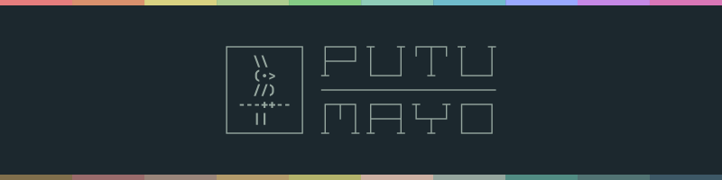

<h1>
<picture id="putumayo">
  <source media="(prefers-color-scheme: dark)" srcset="_assets/gh-header-midnight.svg">
  <source media="(prefers-color-scheme: light)" srcset="_assets/gh-header-midnight.svg">
  
</picture>
</h1>

Putumayo is a a rainforest-inspired color theme for CLI-oriented software developers.

## Features

- 🌓 Dark theme (light theme will be created in the future).
- 🎨 Meticulously crafted and balanced selection of colors.
- 📺 Focused on CLI products to give a pleasant experience for terminal users.
- 👥 AAA accessibility in most cases.
- 🌳 Inspired by nature.

## Table of contents

  - [Features](#features)
  - [Table of Contents](#table-of-contents)
  - [Concept](#concept)
  - [Variants](#variants)
  - [Color scheme](#color-scheme)
  - [Accessibility](#accessibility)
  
## Concept

In the jungle you find yourself surrounded by millions of leaves displaying a multitude of green shades, from yellowish to bluish to brownish. The soil and the trunks exhibit an abundance of browns and greys. These colors give you a sense of serenity and recharge. But if you keep a watchful eye around, you'll start finding little treasures of color: a magnificent deep blue butterfly appears from nowhere; a little bright yellow frog stands still in a leave; a beautiful purple orchid hangs from a branch; a bunch of noisy red guacamayas fly from one tree to another.

That was the feeling I had when I visited the Putumayo rainforest in Colombia. Some weeks later, when I returned to work, I wondered if it was possible to somehow recall that sensation in my day to day use of the terminal. And that's how the Putumayo project was born. I decided to create a theme that balanced the muted main colors of the rainforest, with the vibrant ocasional colors of the exuberant little creatures that inhabit it.

In practice, this means that frequent/large elements in the UI or code should use various shades of green and brown —emulating the leaves, trunks, and soil—, while infrequent/small elements should use shades of blue, magenta, red, orange, and yellow —emulating the flowers, butterflies, birds, and amphibians living inside—.

The result is a beautiful and pleasant color scheme that mixes both the calming tones and prismatic diversity of the rainforests of our planet.

## Variants

Currently Putumayo has only a dark variant, but I'm expecting to develop a bright variant in the future.

The name of the dark variant is "Putumayo Midnight", while the bright variant is referred to as "Putumayo Sunlight".

## Color scheme

The color palette was meticulously crafted to expose a balanced collection of swatches along with a simple but effective pattern of usage for them. This configuration avoids visual fatigue during long coding sessions, while asisting focus.

This was achieved by observing the following principles:

- Background colors should admit a reasonable contrast between them and any foreground color to ensure a clear readability while preventing long term visual exhaustion.

- Foreground colors should represent all main sections of the color wheel, with additional variations, to ensure an heterogeneous but cohesive arrangement.

- All colors in the palette should be defined using precise values of hue, saturation and brightness to obtain a harmonic set of easily distinguishable swatches.

- There should be a desing guide to ensure that frequent/large elements are styled using calming/muted tones, while infrequent/small elements are styled with distinctive/saturated ones, to aim for a unique balance between sobriety and enthusiasm.

## Accessibility 

Regarding accessibility, the contrast between any foreground color and the main background (bg10) always meet AAA standard. This is accomplished without relying on exesive contrast that can quickly tire the eyes of the user.